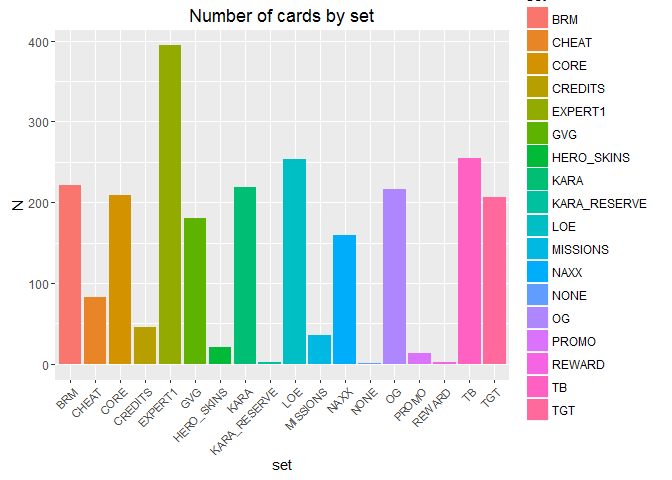
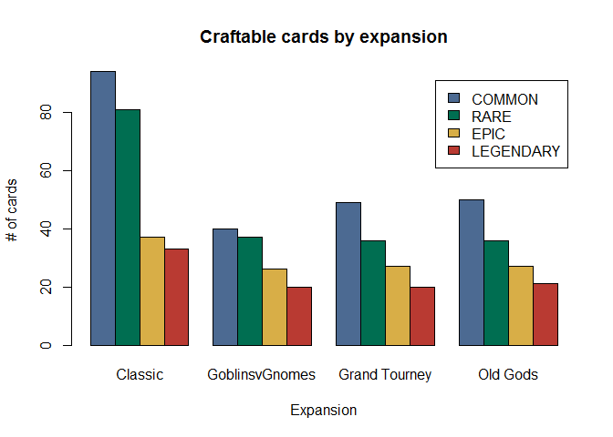
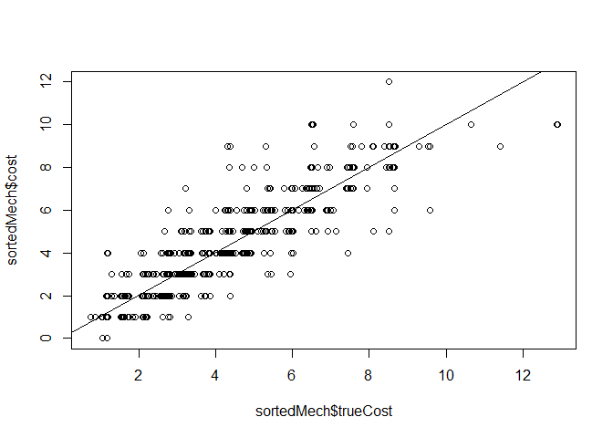
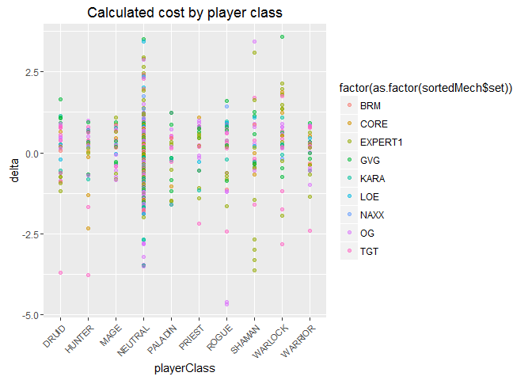
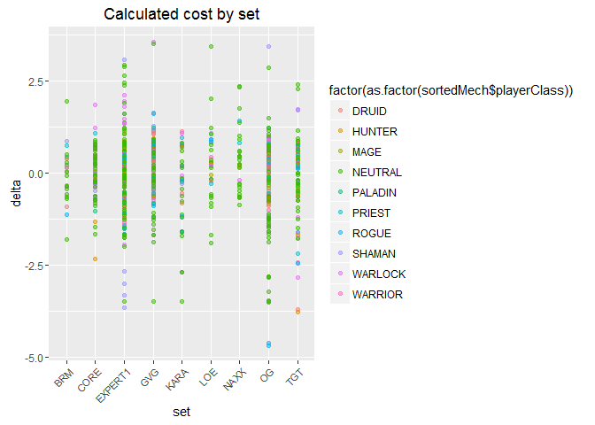

# Hearthstone Card Power and Costs
Kier Groulx  
October 25, 2016  


# Introduction
Recently, a dataset was published on Kaggle (<https://www.kaggle.com/jeradrose/hearthstone-cards>) which contained a fairly well documented ordering of data on the corpus of available Hearthstone cards as of October 2016.  This dataset, while containing a lot of information about the cards themselves, regrettably did not contain any real world statistical data.  Searching around led to a few different ad hoc API implementations, but nothing official from Blizzard themselves.  Regardless, a look at this data may give some insights as to design principles that Blizzard is following to keep Hearthstone a relatively balanced and accessible game.

To start with, let's load in the data and relevant packages.


```r
library(data.table)
library(ggplot2)
library(dplyr)
library(tidyr)
library(shiny)
cards <- fread("cards.csv")
```

```
## Warning in fread("cards.csv"): Bumped column 16 to type character on data
## row 34, field contains 'Deal 1 damage.'. Coercing previously read values
## in this column from logical, integer or numeric back to character which
## may not be lossless; e.g., if '00' and '000' occurred before they will
## now be just '0', and there may be inconsistencies with treatment of ',,'
## and ',NA,' too (if they occurred in this column before the bump). If this
## matters please rerun and set 'colClasses' to 'character' for this column.
## Please note that column type detection uses the first 5 rows, the middle
## 5 rows and the last 5 rows, so hopefully this message should be very rare.
## If reporting to datatable-help, please rerun and include the output from
## verbose=TRUE.
```

```r
costs <- fread("dust_costs.csv")
mechanic <- fread("mechanics.csv")
```

To begin with, we can create an initial graph just to identify how many cards are in each set from the data.

```r
cardset <- cards[,.N,by=set][order(-N)]
ggplot(cardset,aes(x=set,y=N,fill=set))+
    theme(axis.text.x = element_text(angle = 45, size=8,hjust = 1))+
    geom_bar(stat="identity")+
    ggtitle("Number of cards by set")
```

<!-- -->

Well, this looks a bit messier than thought.  The categories of card sets vary wildly, which lends the idea that some of these categories may not be as clearly classified as we thought.  (Looking into the bins, some categories contained accrediting information, cards used by bosses, or otherwise unattainable cards.)  Let's start cleaning this up a bit.

Before we go on much further, however, let's delineate what goals we might like to answer by looking at this dataset.  An initial list of questions may look like this:

* Get a view of the cost, attack, and health of minion cards by player class (is one class overpowered?).

* Get a view of the cost, attack, and health of minion cards by expansion over time (is there power creep here?).

* Get a view of the cost, attack, and health of minion cards by rarity (are rarer cards better?).

* Look at the dust cost of cards by player class (what class is easiest to get into for new players?).

* Look at the dust cost of cards by expansion over time (is Hearthstone getting less accessible over time?).

We will keep these questions in mind as we start to explore.  To begin with, we will extract all legal cards' core data (excluding Tavern Brawl exclusive cards due to their uncollectability and unpredictability) and begin to reshape the data.  This includes adding release dates to the data such that we can order and track variability across time.


```r
df <- data.frame(cards)
features <- c("BRM","CORE","EXPERT1","GVG","KARA","LOE","NAXX","OG","TGT")
legal <- df[df$set %in% features,]
legal <- legal[is.na(legal$collectible) == 0,]
# add dates
legal$release <- as.Date("2014-03-14")
legal$release[legal$set == "NAXX"] <- as.Date("2014-07-22")
legal$release[legal$set == "GVG"] <- as.Date("2014-12-08")
legal$release[legal$set == "BRM"] <- as.Date("2015-04-02")
legal$release[legal$set == "TGT"] <- as.Date("2015-08-24")
legal$release[legal$set == "LOE"] <- as.Date("2015-11-12")
legal$release[legal$set == "OG"] <- as.Date("2016-04-26")
legal$release[legal$set == "KARA"] <- as.Date("2016-08-11")
```

To add onto this, let's dig into the crafting cost dataset and merge this in.  We don't really have to do this, since cards have preset crafting values based on their rarities (an attribute already in the core set), but since we have the data present we may as well use it.


```r
df <- data.frame(costs)
# decimate set due to repeating nature
dust <- df[df$action == "CRAFTING_NORMAL",]
# get combined list
total <- merge(legal,dust,by="card_id")
cross <- table(total$rarity,total$set)
# clean up
tmpRow <- cross[4,]
cross[4,] <- cross[3,]
cross[3,] <- cross[2,]
cross[2,] <- tmpRow
tmpRow <- cross[,4]
cross[,4] <- cross[,3]
cross[,3] <- tmpRow
row.names(cross) <- c("COMMON","RARE","EPIC","LEGENDARY")
colnames(cross) <- c("Classic","GoblinsvGnomes","Grand Tourney","Old Gods")
# plot craftable cards by expansion
barplot(cross,main="Craftable cards by expansion",xlab="Expansion",ylab="# of cards",col=c("#4C6A92","#006E51","#D8AE47","#B93A32"),legend=rownames(cross),beside=T)
```

<!-- -->

This graph starts to tell us a bit more about the data.  To no surprise, there were a larger amount of cards at launch to support the beginning of the game; however, it looks like the number of cards for each expansion has been roughly the same.  As the common Hearthstone player knows, common cards are easy enough to come by, but epic and legendary cards are where the difficulties of collecting dust and crafting come in.  Since this is such a time-consuming process and must be thought out efficiently, are there a higher proportion of rarer cards in any expansion?  Let's check the proportion of epics and legendaries within each set.


```r
(cross[4,]+cross[3,]) / colSums(cross)
```

```
##        Classic GoblinsvGnomes  Grand Tourney       Old Gods 
##      0.2857143      0.3739837      0.3560606      0.3582090
```

It doesn't seem like there's a huge effect there; the basic pack, due to its nature of being released on launch, had a much higher percentage of common and rare cards such that people could build decks quicker.  How about if we check rarity proportions by player class?


```r
cross2 <- table(total$rarity,total$playerClass)
tmpRow <- cross2[4,]
cross2[4,] <- cross2[3,]
cross2[3,] <- cross2[2,]
cross2[2,] <- tmpRow
row.names(cross2) <- c("COMMON","RARE","EPIC","LEGENDARY")
cross2
```

```
##            
##             DRUID HUNTER MAGE NEUTRAL PALADIN PRIEST ROGUE SHAMAN WARLOCK
##   COMMON       14     14   14     107      14     14    14     14      14
##   RARE         14     14   14      64      14     14    14     14      14
##   EPIC          9      9    9      36       9      9     9      9       9
##   LEGENDARY     4      5    4      57       4      4     4      4       4
##            
##             WARRIOR
##   COMMON         14
##   RARE           14
##   EPIC            9
##   LEGENDARY       4
```

Interestingly enough, the classes are all equally difficult to break into.  If a person had just created a Hearthstone account, they could choose any class and have to pay the same amount of dust to obtain every card, with the exception of the Hunter class which has one extra legendary.  That would set this fictitious person back 11,960 dust for every class but Hunters, and 13560 dust to construct every card in the Hunter class.

Just for fun, let's look at a few tables that detail out the extremes of Hearthstone cards - the cards with the highest cost, attack, or health.


```r
# costly cards (10): DOOM! for warlock, mind control for priest, anyfin can happen for paladin,
#  pyroblast for mage, varian wrynn for warrior
# also neutral giants
t <- table(legal$cost,legal$playerClass)
t
```

```
##     
##      DRUID HUNTER MAGE NEUTRAL PALADIN PRIEST ROGUE SHAMAN WARLOCK WARRIOR
##   0      2      0    1       3       1      3     3      2       2       1
##   1      7      9    6      35      15     10     9      9      10       8
##   2      8     19   10      59       7     13    12     15      11      14
##   3      9     14   17      72      11      6    13     11      10      13
##   4     12      4   11      58       7     11     9     11       9       8
##   5      5      7    5      54       9      8     7      6       6       6
##   6      7      2    3      42       4      6     4      3       6       3
##   7      5      3    4      16       2      2     1      2       2       5
##   8      1      1    2      12       3      0     0      1       1       1
##   9      4      2    0      13       0      0     2      0       2       0
##   10     0      0    1       9       1      1     0      0       1       1
##   12     0      0    0       3       0      0     0      0       0       0
##   25     0      0    0       1       0      0     0      0       0       0
```

```r
colMeans(t)
```

```
##     DRUID    HUNTER      MAGE   NEUTRAL   PALADIN    PRIEST     ROGUE 
##  4.615385  4.692308  4.615385 29.000000  4.615385  4.615385  4.615385 
##    SHAMAN   WARLOCK   WARRIOR 
##  4.615385  4.615385  4.615385
```

```r
# attacky cards(9): mal'ganis for warlock, anima golem for warlock, malorne for druid
t <- table(legal$attack,legal$playerClass)
t
```

```
##     
##      DRUID HUNTER MAGE NEUTRAL PALADIN PRIEST ROGUE SHAMAN WARLOCK WARRIOR
##   0      0      0    0      11       0      2     0      3       2       0
##   1      1      3    2      58       4      3     5      2       7       3
##   2      8      9    6      81       8      3     8      6       2       9
##   3      3      7    8      66       6      8     8     11       9       9
##   4      5      6    2      61       3      3     7      5       4       4
##   5      7      1    4      34       3      4     5      2       4       4
##   6      1      3    2      21       3      3     1      1       2       4
##   7      2      0    2      19       0      1     0      3       1       3
##   8      1      2    1      15       1      0     1      0       0       0
##   9      1      0    0       6       0      0     0      0       2       0
##   10     0      0    0       3       0      0     0      0       0       0
##   12     0      0    0       2       0      0     0      0       0       0
```

```r
colMeans(t)
```

```
##     DRUID    HUNTER      MAGE   NEUTRAL   PALADIN    PRIEST     ROGUE 
##  2.416667  2.583333  2.250000 31.416667  2.333333  2.250000  2.916667 
##    SHAMAN   WARLOCK   WARRIOR 
##  2.750000  2.750000  3.000000
```

```r
# healthy cards(9): gahz'rilla for hunter, anima golem for warlock, grommash hellscream for warrior
# extreme high values here are the actual heroes themselves
t <- table(legal$health,legal$playerClass)
t
```

```
##     
##      DRUID HUNTER MAGE NEUTRAL PALADIN PRIEST ROGUE SHAMAN WARLOCK WARRIOR
##   1      2      5    1      42       1      2     5      1       4       1
##   2      6      7    4      62       2      3    10      3       4       2
##   3      2      5    7      63       6      4     4      5       6       8
##   4      6      3    6      69       4      5     7      6       7       4
##   5      6      4    3      49       3      9     1      5       3       6
##   6      2      1    3      33       3      3     2      4       3       2
##   7      2      0    3      24       2      1     1      2       3       3
##   8      3      2    0      21       1      0     1      1       1       0
##   9      0      1    0       6       0      0     0      0       1       1
##   10     0      0    0       4       0      0     0      0       0       0
##   12     0      0    0       4       0      0     0      0       0       0
##   15     0      0    0       0       0      0     0      0       1       0
##   30     1      1    1       0       1      1     1      1       1       1
```

```r
colMeans(t)
```

```
##     DRUID    HUNTER      MAGE   NEUTRAL   PALADIN    PRIEST     ROGUE 
##  2.307692  2.230769  2.153846 29.000000  1.769231  2.153846  2.461538 
##    SHAMAN   WARLOCK   WARRIOR 
##  2.153846  2.615385  2.153846
```

There aren't many cards that fall into extreme categories, but one class seems to stand out: Warlocks.  They are represented in each extreme category, and in two categories, that card is the same card (Anima Golem, a 6 cost 9/9 where it is destroyed if its owner controls nothing else).  Also, while they don't overall lead any pack in terms of overall attack or health in minions, they are consistently in the upper half.

However, let's turn our attention now to the calculated 'true cost' of each card.  While each card already has an explicit cost, we can calculate whether the explicit cost sets the card up to be slightly overpowered or underpowered by comparing the corpus of cards against each other.  To do this, we can construct a matrix of all the relevant attributes of each card (attack, health, and card effects) and gain expected costs for each attribute (say, perhaps a card having the "Battlecry" attribute adds roughly 1.5 mana to its cost).  While this may not work as well for underrepresented attributes (some cards are discarded directly from the deck, or only buff Murlocs, or something of that nature), it can work for a large variety of the attributes found on most cards.


```r
features = c("card_id","playerClass","type","name","cost","attack","health","rarity","durability","set")
mech <- merge(legal[names(legal) %in% features],mechanic,by="card_id",all.x=T)
minions <- subset(mech,mech$type == "MINION")
features = c("name","cost","attack","health")
mech2 <- mech[names(mech) %in% features]
mech2 <- subset(mech2,mech$type == "MINION")
sort(table(minions$mechanic))
```

```
## 
##            InvisibleDeathrattle                   ADJACENT_BUFF 
##                               1                               2 
##                         TOPDECK                     CANT_ATTACK 
##                               2                               3 
##                          FREEZE CANT_BE_TARGETED_BY_HERO_POWERS 
##                               3                               4 
##      CANT_BE_TARGETED_BY_SPELLS                       FORGETFUL 
##                               4                               4 
##                       POISONOUS                           COMBO 
##                               4                               7 
##                         ENRAGED                        WINDFURY 
##                               9                               9 
##                      CHOOSE_ONE                         STEALTH 
##                              10                              13 
##                   DIVINE_SHIELD                          CHARGE 
##                              14                              16 
##                          RITUAL                         INSPIRE 
##                              17                              21 
##                            AURA                           TAUNT 
##                              28                              51 
##                     DEATHRATTLE                       BATTLECRY 
##                              66                             228
```

One thing that may be helpful to do here in the future is some form of factor analysis.  For instance, "Adjacent Buff" isn't well represented here, but it may be functionally similar enough to "Aura", which is well represented, that we could merge the two categories together.  For the sake of this analysis, we will leave them be, but it may be a good area to revisit in the future.  


```r
r <- data.frame(unique(minions$mechanic)[2:23]) # get rid of NA
t <- apply(r,1,function(x) grepl(x,minions$mechanic))
colnames(t) <- unique(mech$mechanic)[2:23]
mech2 <- cbind(mech2,t)
fit <- lsfit(mech2[,c(-1,-2)], mech2[,2])
z <- fit$coefficients[2:25]
trueCost <- apply(mech2[3:26],1,function(x) x*z)
minions$trueCost <- colSums(trueCost)
minions$delta <- minions$trueCost - minions$cost
ind <- sort(minions$delta,index.return=T,decreasing=T)
sortedMech <- minions[ind$ix,]
# dropping Molten Giant as he is a very clear outlier
sortedMech <- sortedMech[1:693,]
plot(sortedMech$trueCost,sortedMech$cost)
abline(0,1)
```

<!-- -->

After cleaning the data a little bit more, fitting a least-squares regression to the tidy data, and getting rid of the very clear outlier of Molten Giant as his effect was not taken well by the model, we now have a sorted list of all minions according to their calculated 'true cost'.  Notice that a large majority of the minion's actual cost matches the cost that we have calculated; however, to make this an interesting game, there are some variants included in the data.

Out of curiosity, what did our model say were the best cards in the set?


```r
head(unique(sortedMech$name))
```

```
## [1] "Anima Golem"            "Fel Reaver"            
## [3] "Eerie Statue"           "Flamewreathed Faceless"
## [5] "Earth Elemental"        "Injured Blademaster"
```

There's that Anima Golem again!  And the worst cards?


```r
tail(unique(sortedMech$name))
```

```
## [1] "Clockwork Giant"       "Arcane Giant"          "N'Zoth, the Corruptor"
## [4] "Aviana"                "Acidmaw"               "Blade of C'Thun"
```

Not a huge surprise; our model has an aversion to Giant cards, and the rest have very situational effects.  

Some final thoughts here: let's look at a graph of the power we computed here by player class.  The x-axis here represents every class in the game, while the y-axis represents power of the card: a positive delta indicates a card that may be overpowered (its true cost exceeds its cost), while a negative delta indicates a card that may be underpowered.  Keep in mind that some effects are not well understood by the model, but this should serve as a good rough indicator.


```r
ggplot(sortedMech,aes(x=playerClass,y=delta))+
    theme(axis.text.x = element_text(angle = 45, size=8,hjust = 1))+
    geom_point(alpha=0.5,aes(color=factor(as.factor(sortedMech$set))))+
    ggtitle("Calculated cost by player class")
```

<!-- -->

In the same vein, let's look at a graph of the true cost by expansion of release.


```r
ggplot(sortedMech,aes(x=set,y=delta))+
    theme(axis.text.x = element_text(angle = 45, size=8,hjust = 1))+
    geom_point(alpha=0.5,aes(color=factor(as.factor(sortedMech$playerClass))))+
    ggtitle("Calculated cost by set")
```

<!-- -->

Quick takeaways from here: Whispers of the Old Gods seems generally overpowered compared to all other cards, while One Night in Karazhan seems generally underpowered, though this may be due to new mechanics that are difficult for the system to learn. 

While these plots are rather colorful, they also come off as slight messy.  A Shiny app with interactivity to disentangle these graphs can be found at <https://kgroulx.shinyapps.io/hearthstone-cards/>.  This interactive app allows you to view obtainable card's computed true cost sorted by player class, set released, or rarity of card.  Positive values of 'delta' in any of these cases reflect that a card is relatively overpowered compared to all other current Hearthstone cards, while negative values represent that a card is relatively underpowered.  If these values lie close to 0, this is fine - card costs cannot be exact, and rounding errors may occur due to average cost possibly being a fraction while actual in-game card costs must be whole numbers.  However, some classes have cards that are relatively strong, and it may be interesting to conduct a more in-depth analysis of this data.  For example, two classes have cards that have deltas of 2 or more - warlocks, who have 2 epic (Anima Golem, Pit Lord) and 1 rare (Doomguard) cards, and shamans, who have 1 epic (Earth Elemental) and 1 common (Flamewreathed Faceless) cards.  These may be cards to watch out for, balance wise, in the near future.

Hopefully this has been an illuminating analysis of the state of Hearthstone at the moment.  I'll see you all in the Arena with my new Warlock deck!
